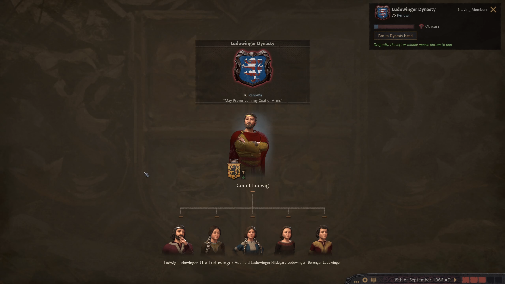
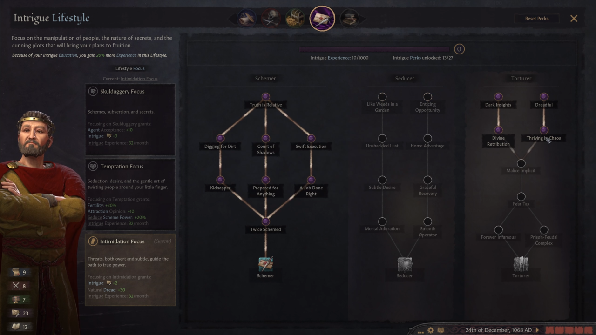

# T.E.I.O.U.: A Thuringian AAR

## Chapter 1: The Impaler of Orlamünde (1066–1080)

In 1066, as William the Bastard presses his claim on the English throne, the Ludowinger dynasty rules over a modest realm in Thuringia.

Small and generally unknown, the house was founded by [Louis the Bearded](https://de.wikipedia.org/wiki/Ludwig_der_B%C3%A4rtige "Louis the Bearded"), who received the lands between Gotha and Schmalkalden for services rendered to the [Kaiser Heinrich III](https://en.wikipedia.org/wiki/Henry_III,_Holy_Roman_Emperor "Henry III, Holy Roman Emperor"). He is survived by his son Count Ludwig who, along with his progeny, are all that remains of this fledgling house. In our timeline, Count Ludwig was most well known for jumping across a river, [and was known as "the Springer."](https://en.wikipedia.org/wiki/Louis_the_Springer "Louis the Springer") Hopefully he accomplishes more here.

Count Ludwig, though a fairly competent schemer, has had little use for his talents to date. Plagued by indecisiveness, he never kept his mind on a task long enough to accomplish anything of note. However, hell hath no fury like a Springer scorned...

Count Ludwig pays homage to his liege, the Margrave of Meissen. In our timeline, he was...[not famous for much, other than ruling for a paltry five years](https://en.wikipedia.org/wiki/Otto_I,_Margrave_of_Meissen "Otto I, Margrave of Meissen"). Maybe this foreshadows this timeline?

In turn, the Margrave himself swears fealty to Kaiser Heinrich IV of the Holy Roman Empire. In our timeline, [Heinrich IV was excommunicated for simony](https://en.wikipedia.org/wiki/Henry_IV,_Holy_Roman_Emperor "Henry IV, Holy Roman Emperor"), and was forced to abdicate the throne to his son. Will he fare better here?

Count Ludwig's firstborn son and heir is named after himself. Though fairly intelligent, Ludwig the Younger is more of a...physical learner. He's also not above lying to "further his studies." In our timeline, this Ludwig would become [Louis I, Landgrave of Thuringia](https://en.wikipedia.org/wiki/Louis_I,_Landgrave_of_Thuringia "Louis I, Landgrave of Thuringia"). Will similar greatness await our Ludwig the Younger?

In an attempt to foster closer relations with his liege—and also in an attempt to get his son to settle down soon—Count Ludwig broaches the subject of a potential engagement between his Ludwig the Younger and the Margrave's second born, Adelheid. However, the Margrave has the gall to insinuate that his daughter would be "marrying down" if such a marriage were to take place.

Filled with wrath from this slight, the usually indecisive Count Ludwig finally has an outlet for his unscrupulous tendencies. He tells his spymaster, the Baron Hermann, to dig around the court of the Margrave for any potentially unsavory secrets Otto may have involved himself in. In the meantime, Ludwig himself—in his capacity as the spymaster for Otto—begins forging documents to incriminate the Margrave.

Ludwig the Younger will marry at all costs.

Unfortunately for Ludwig, Otto has hid his secrets well, if he has any. Ludwig tells his spymaster to keep digging for clues.

All of this intrigue gives the Count strange dreams. He envisions fields of corpses surrounding himself, perhaps representing the lengths he might go through to achieve his goals. Perhaps in the hopes of invoking the Law of Attraction, Ludwig tells Hermann to get the corpses ready.

In the meantime, Hermann still has had no luck finding learning anything interesting about Otto. Gossip and rumors will have to do.

Count Ludwig repays the embarrassment lent to the Count to Otto, sending in a circus troupe as he is in the midst of changing.

In an effort to keep rumors of the incident from spreading, Margrave Otto reluctantly agrees to the original marriage proposal. However, his eldest Oda, is engaged to a lowly knight. Does he think House Ludowinger below the unlanded?

The score is still not settled.

These schemes have awoken something inside of Ludwig. His dreams are becoming more and more disturbing as of late, as his mind turns toward torturing all who oppose him.

For now, he will have to focus his energies on beasts.

In an unfortunate accident, it seems Oda has accidentally ingested court poison "accidentally" left in the grand hall of the Margrave. Ludwig the Younger's betrothed is now heir to the march.

Ludwig the Elder will ensure the accession happens sooner rather than later.

While his plan his set in motion, Count Ludwig finally takes the chance to pay attention to the state of his realm. The capital of Orlamünde—taken from heathen Slavs only a generation ago—still has memories of being ruled by one of their own, and the Count's presence has stirred some resentment. In an effort to ease tensions with the locals, Count Ludwig decides to move his court to the German city of Schmalkalden.

It seems the move has driven the Count's wife, Cecilie, to hysterics. The slightest of provocations from the court physician, Shoinlin, has gravely offended her. To appease his wife, Count Ludwig banishes Shoinlin from his realm.

Not even a month after his move, Count Ludwig is already back at insulting the locals. Some things never change.

Speaking of upset peasants, it seems Margrave Otto's treatment of his people also leaves much to be desired. Through bribes and local connections, Count Ludwig stages a riot against the Margrave as he passes through the streets. Otto is murdered in the confusion, not even five years after his insult of Ludwig. Some say the Count had the ear of Otto taken from the body as a personal souvenir of his triumph.

There is a new Margravine. Adelheid, the young betrothed of Ludwig the Younger, has inherited all of her father's lands and titles after his death. Good with money, the March will surely prosper.

Satisfied for the moment with his plot of revenge against the Weimar dynasty, and fed up with his wife Cecilie, Count Ludwig takes to flirting with the help.

Count Ludwig's marshal—the Mayor Hartmann, of Eisenach—introduces a talented fighter from the countryside, Siegmund. Though he has an unfortunate appearance, he will be a great addition to the Count's retinue.

If nothing else, his new helm suits him.

Through strong alliances, the Kaiser Heinrich IV has managed to keep the Holy Roman Empire together. Levies from the Count's domain are sent to fight in the wars of the German ally Hungary, who looks to conquer land in the east in the name of God. Such things are of little interest to the Count, but he does his duty as vassal.

While looking for his marshal to discuss the status of the levies, Count Ludwig finds him with the Count's daughter Hildegard! This will not stand. Mayor Hartmann is quickly put in prison, but news of the scandal has already shocked the court.

The relatively new—and unfortunate looking—knight Siegmund is put in charge of finishing the tasks of his former boss. He has quickly risen through the ranks.

The worst has happened, and Hildegard is with child!

Hartmann will regret this for a very long time.

Hoping to avoid similar troubles with the rest of his children, Count Ludwig marries them off as quickly as possible. All but Hildegard, that is—he has a special suitor lined up for her. As the preparations are made, Hildegard gives birth to a son, Landolf the Bastard.

In a coincidence of timing, Margravine Adelheid is also now of age to marry Ludwig the Younger. Hopefully this keeps the lustful Ludowinger heir out of any trouble.

Perhaps feeling they got off on the wrong foot—given the murder of her father and all—Ludwig the Elder attempts to get to know his new daughter-in-law better.

Count Ludwig's wife, Cecilie, once again feels insulted by an innocent comment someone made at court. This time is different, however—the object of her hatred is the recent marshal Siegmund. Though Count Ludwig pleads with his wife to resolve her differences with Siegmund, lest he have to search for a new marshal yet again, Cecilie will have none of it.

With a heavy heart, Count Ludwig bids Siegmund auf Wiedersehen. Though Siegmund's presence in the court of Count Ludwig was short, the Count will never forget him.

Extremely irritated at his wife by this point, Count Ludwig decides to play a prank on Cecilie at a feast he hosts for his courtiers. Disguising a live fowl as part of the main course, it attacks Cecilie as she is about to dig into it. Though the pain of the attack on Cecilie is surely nothing compared to the pain in Ludolf's heart at Siegmund's departure, it does lighten his day a little.

Given the poor treatment with which Count Ludwig treats his subjects, it is perhaps no surprise that a small contingent of unsatisfied peasants have risen up in open rebellion against their liege. They are swiftly put down, and their leader tortured personally by the Count in an attempt to find any potential coconspirators.

Though Siegmund is gone, Count Ludwig is reminded of him everywhere he looks. Even his young bastard grandson, Landolf, has the same unfortunate features as the former knight.

Yet another marshal is found, yet illness quickly strikes him. Perhaps the position is cursed?

Though Count Ludwig has tried in earnest to connect with his daughter-in-law—describing his torture sessions with Mayor Hartmann, his torture sessions with the leader of the peasant rebellion, asking for tips on how to torture, and so on—the Margravine has come out liking the Count even less. Fed up with the diplomatic niceties, Count Ludwig tells Ludwig the Younger to remind the Margravine who does the torturing around here.

Not long after the appropriate threats are made, Cecilie comes to Count Ludwig with yet another complaint about yet another marshal. Running out of men able to carry swords, Count Ludwig tells Cecilie to shut it.

Though the marriage was made purely to keep the Ludowinger name out of disrepute, Count Ludwig's son-in-law sends a messenger begging for aid. Count Jan of Poznań is being attacked by the neighboring Duke of Upper Silesia, who is the liege of Count Jan's brother. His brother claims that, on his deathbed, their father willed Poznań to him, and moves to settle matters on the battlefield.

Though Count Ludwig finds war distasteful—and was barely aware of his son-in-law's existence before now—he is a man of his word, and decides to honor his alliance. The Count sends his troops to provide whatever help they can.

While Count Ludwig's marshal Walther von Isenberg trains and gathers the troops, the overall strategy for the war is left to Baldur. In times of peace, Baldur is in charge of the finances of the realm. However, as a competent commander—one of the few left after many marshals were sacked—he will have to make do.

Due to the number of levies already sent off to fight the Kaiser's wars, Walther is only able to gather a pittance of troops. Even worse, the Duchy of Upper Silesia itself lies between Schmalkalden and Poznań. It seems the Duke's troops will reach Count Jan before Count Ludwig does.

While helping Walther and Baldur plan their next moves for the war, a man approaches Count Ludwig—claiming to be a famous sculptor—and requesting gold for a commission. Reminded by his countenance of Siegmund, Count Ludwig kills him in a blind rage. Has Siegmund's exile laid a curse upon this land, creating an extraordinary number of ugly subjects? Perhaps it is just what it means to be from Schmalkalden.

Finally, after much effort, Count Ludwig's relations improve with the Margravine. All it took was the Count insulting his fellow vassal, the Prince-Bishop of Naumburg. Perhaps this is the strategy he should have started with, as it certainly comes more naturally to him than flattery.

Having improved relations with his liege, Count Ludwig's attention is refocused on the war at hand. As suspected, the Silesian army reached the Count's ally's first, forcing them to rout to the north. With the Silesian army still between Count Ludwig's troops and those of the Count of Poznań, Commander Baldur attempts to move north as well.

As feared, the Silesian army catches the allied troops before Baldur can reach them. Though they set up defensive positions in the forests near Żnin, they are simply outnumbered by the Silesians, and take heavy casualties.

Though Count Ludwig's troops have yet to fight in a battle, the war is lost. Commander Baldur begins the long march back home.

Upon returning home to Schmalkalden, Count Ludwig is met with happy news. Margravine Adelheid is with child!

As Count Ludwig celebrates, Kaiser Heinrich IV struggles to keep the loyalty of his Italian subjects. Led by Duchess Matilda of Tuscany—who is disillusioned by the Kaiser's treatment of the Church—they hope to break free from the German yoke.

Further west, it seems William the Bastard was not successful in pursuing his claim to the English throne. Instead, it fell to King Harald Hardrada of Norway, who pursued his claim to the throne as the Anglo-Saxons were fending off William. He has since passed, with England passing to his firstborn son, and Norway his second. Ironically, both are bastards.

Driven back to Normandy, William the Bastard takes to fighting his liege in France for less obligations to the crown. If successful, this may allow William to gather more troops for another invasion of the British Isles.

The Italians are uncontested in Piedmont, as the Kaiser quickly gathers his troops further north.

The Margravine Adelheid has given birth! Adelheid the Younger is born to the Ludowinger dynasty, which continues its tradition of unoriginal names.

In solidarity with his zealous Italian brethren, the Pope excommunicates the Kaiser. Will this draw neighboring Catholics into the war?

Finally, a suitable suitor has been found for Hildegard. After sullying the Ludowinger name by bearing the child of Mayor Hartmann, she is wed to the fattest, most cowardly German around. Count Ludwig tends to hold grudges.

Out of troops and with his lands fully occupied by the Silesians, Count Jan of Poznań is forced to make peace. He is forced to move his court to Kalisz, further to the east. The war is lost.

The Duke of Upper Silesia now has a commanding presence within Poland. Though this worries the Polish King, there is little he can do.

Close to the war raging in Italy, the South German vassals have been the primary source of troops for the Kaiser. Unhappy with their people dying across the Alps, they petition their liege to put a quick end to his war. The Kaiser refuses, and both the South Germans and the King of Bohemia join the rebellion. The Kaiser is losing friends quickly.

It seems both German politics and a second pregnancy have taken their toll on the Margravine Adelheid, sending her to an early grave. The young Adelheid—Count Ludwig's granddaughter—is now Margravine Adelheid II, Count Ludwig's own liege, at just one year of age. An alliance is quickly made with his son—the regent of Adelheid II—to protect his granddaughter's position.

Realizing ties must be strengthened with his allies if he is to reclaim his lands in Poznań, Count Jan of Kalisz visits Count Ludwig in Schmalkalden. As Count Ludwig celebrates his granddaughters accession—and Count Jan laments his recent loss of land—Count Ludwig makes eyes with the resident barmaid. Having grown distant from his wife Cecilie since their move to Schmalkalden, Count Ludwig takes the celebrations into her bedchambers. It quickly becomes a recurring visit.

As the realm and court enter a period of relative calm, Count Ludwig finally finds time again for his favorite hobby of torturing Mayor Hartmann.

With the consolidation of so much power at the hands of the Silesian duke, the position of the Polish King Bolesław has never been weaker. Taking advantage of this weakness, Count Ludwig spreads rumors that Bolesław's son and heir Bezprym is actually Count Ludwig's son. Perhaps these rumors will ingratiate Bezprym to his "true father" the Count once he ascends the throne.

Further south, Kaiser Heinrich IV is hopelessly outnumbered by his own vassals. Though the Kaiser has quickly made peace with his Italian subjects, it is too little too late for his German subjects. Having gathered in Ulm, the South Germans have slowly advanced toward the Kaiser's own court in Klingenberg. He is soon captured and forced to reduce the obligations of his vassals.

Distraught over the loss of his wife Adelheid, Ludwig the Younger quickly finds and marries Bia von Bärenburg. A sucker for food and not the sharpest knife in the cupboard, Ludwig the Younger's beer goggles must have been very tight when they first met. One must hope that any future children take after their grandfather rather than their parents.

Disappointed by his son's taste in women, Count Ludwig leaves to hunt. Unfortunately, things turn from bad to worse, as a massive boar injures the Count. Though his physician is able to treat his wounds superficially, the Count's condition worsens day by day.

He was not long for this world. A conniving man, Count Ludwig succeeded in making his granddaughter the Margravine of Meissen. If Ludwig the Younger can show some restraint, the Ludowinger lands will be consolidated, ensuring the success of the duchy for years to come.

If.

