# T.E.I.O.U.: A Thüringian AAR

## Chapter 2: Ludwig the Conqueror (1080–1149)

In 1080, Count Ludwig the Elder passes and leaves his lands to his two sons, Ludwig the Younger and Berengar Ludowinger. The majority of the lands—those centered around Schmalkalden and the old capital Orlamünde—pass to Ludowig, while the easternmost parts of the realm are passed to Berengar. Both continue to pay homage to their liege, Ludwig the Younger's daughter Margravine Adelheid II of Meissen, now only four years of age.

While his father used his duplicitous talents to further the status of his dynasty, the new Count Ludwig II uses his talents to seduce women. The latest of his whims is the brawny Bia von Bärenburg. A naive woman, she has quickly fallen for the donjuanesque ways of Ludwig II. 

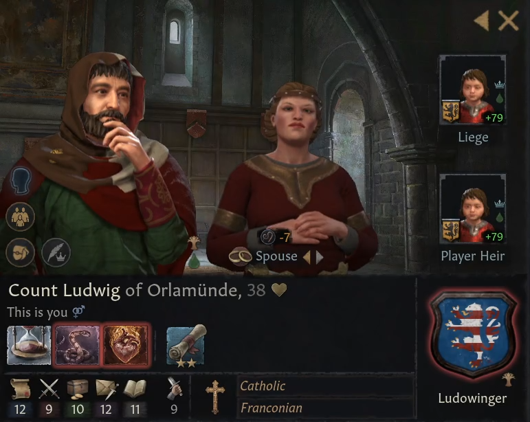

Before his passing, Count Ludwig I warned his son to control his impulses for the sake of the fledgling dynasty. For if their modest lands were to split any further among many heirs, their already weak realm would surely be lost to the annals of time.

Before the corpse is cold, Bia announces she is expecting.

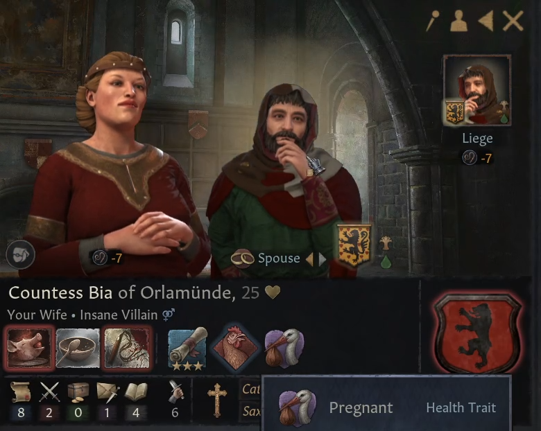

Due to his education—and aided by practicing smooth words on women—Ludwig II is a reasonable diplomat. As such, his early reign is spent with both his landed brother and daughter, and growing into his role as the Ludowinger partiarch. Furthermore, perhaps due to his own unlikely marriage with the previous Margravine out of a position of relative obscurity, rumors quickly spread of the eligibility of the single members of the dynasty.

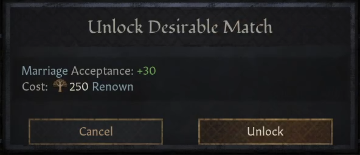

In the meantime, Ludwig II sends Baron Hermann to neighboring rulers in the hopes of fostering both good relations and good will. A symptom of the Baron's previous position as the Schmalkalden spymaster also means more information about neighboring realms is gathered surreptitiously.

To the east, past the lands of Silesia that Ludwig I fought in, lie the Dual Kingdoms of Ruthenia and Galicia–Volhynia. Further still to the north and east lie the Grand Principalities of Chernigov and Novgorod. Only a few generations ago, these lands were all united under a single Rurikid banner, but a plurality of heirs has progressively split the dynasty into a multitude of independent houses.

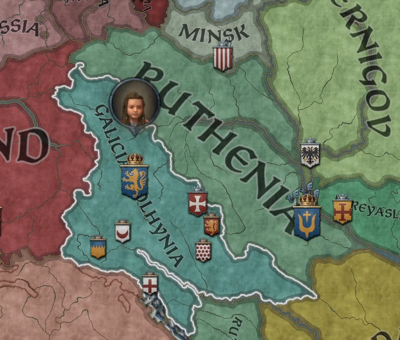

Closer to home, the heir of the Kingdom of Poland is the young Prince Bezprym. His ancestry was recently called into question by Count Ludwig I. Will the Kingdom be weakened for it?

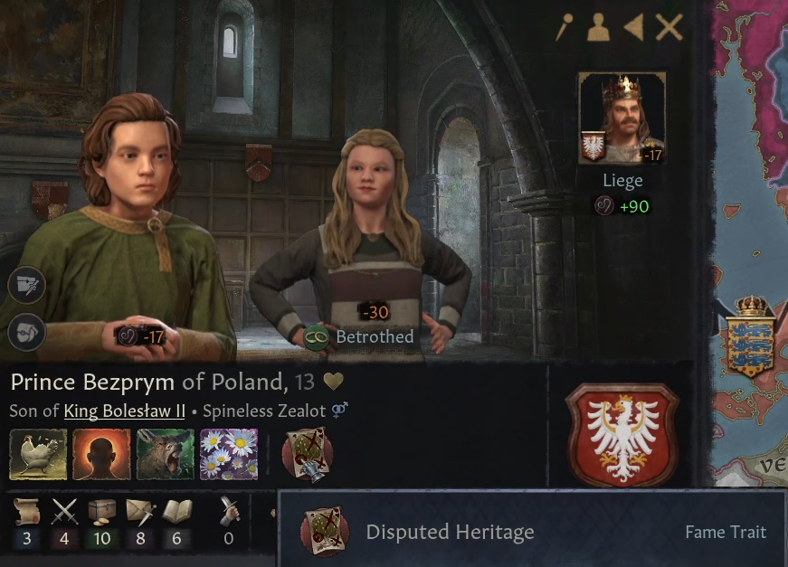

Further west, holy wars rage across the Iberian peninsula. The southern half is ruled by the Muslim remnants of the self-proclaimed Caliphate of Córdoba, while the northern half the Catholic remnants of the self-proclaimed Empire of León. Through an unfortunate accident involving the death of the King García of Galicia, Alfonso VI of León has inherited his elder brother's lands in the northwest of the peninsula.

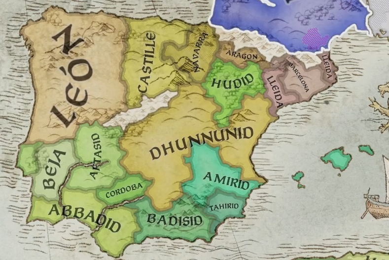

After putting down revolts in Normandy, King Philippe has maintained a solid grip of France.

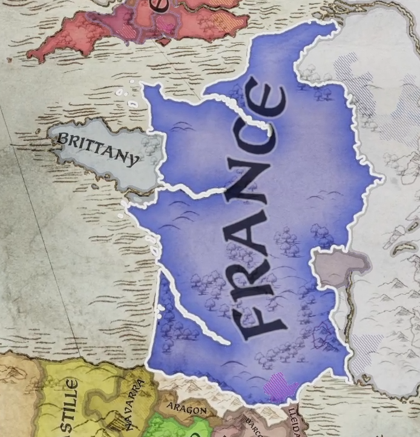

Though he lost on the battlefield to Harald Hardrada, Harold Godwineson escaped with his life and managed to retreat to his lands in Dorset to lick his wounds. With the accession of the relatively unpopular bastard King Magnus to the English throne, Harold has seized his chance to take back his rightful throne.

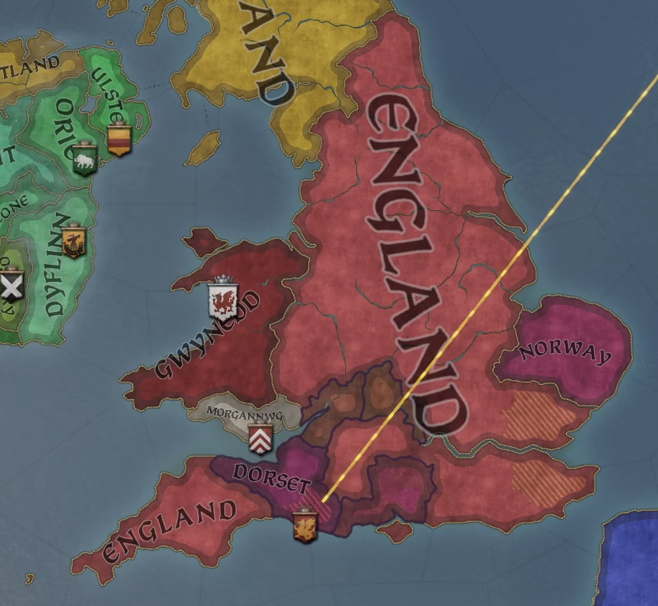

Finally, at home, the Kaiser struggles to maintain a cohesive Empire, and is almost eight hundred florins in debt. Only a few years ago, the excommunicated Kaiser Heinrich IV just barely won an independence war started by the devout Northern Italian Catholics, and only at the cost of serious concessions to his South German vassals. Caught between the crossfires of these wars, the Kaiser's vassals in the Alps and the peasants of Bavaria are fed up with imperial politics, and take this moment of weakness as a chance to secede.

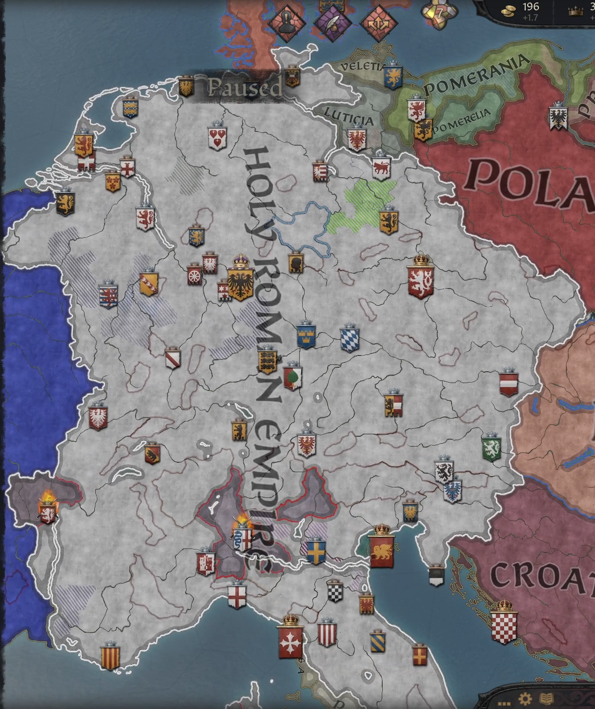

Back in Schmalkalden, Bia bears a daughter, not due to any inheritance. However, in the ensuing festivities, Ludwig II and Bia conceived another child—nine months later, Bia bears a son! In the Ludowinger tradition, he is named Ludwig. Though once the Margravine Adelheid II was the heir to the counties of Schmalkalden and Orlamünde, the lands are now split between the two children of Ludwig II, mimicking the succession of the Ruthenian lands in the east. Within the year, Bia is pregnant again.

Count Ludwig II did not heed his father's advice.

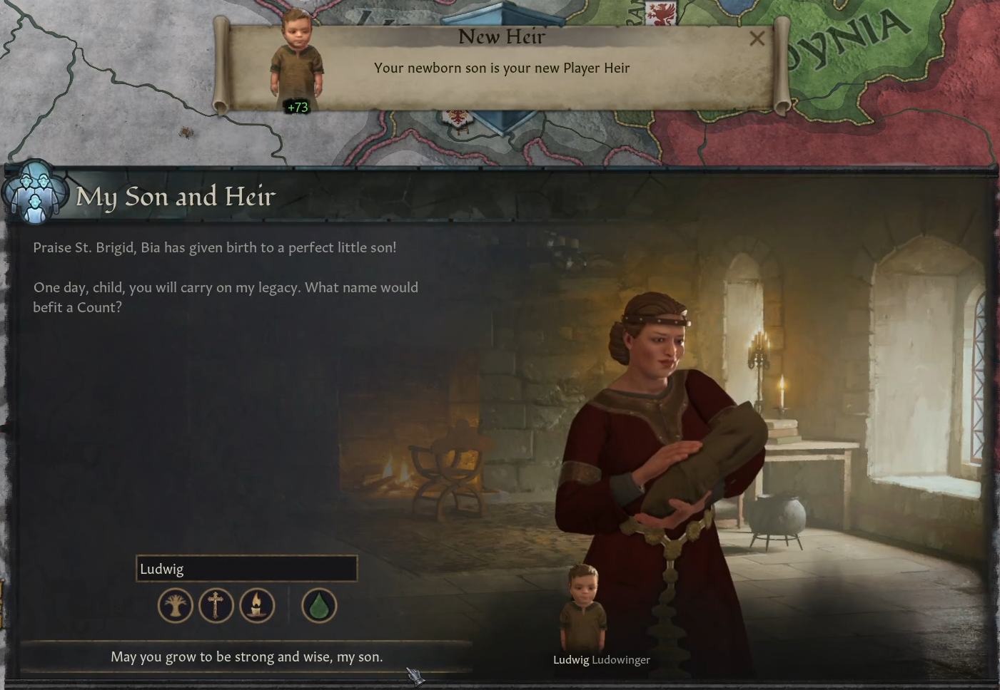

The Ludowinger family remains close after the death of their father, and bonds of alliance are negotiated between the landed brothers during a visit by Berengar to Schmalkalden. Additionally, Ludwig's sister and close friend Uta—the Duchess of Brittany by marriage—encourages close relations between Ludwig and the Duke of Brittany. Though Ludwig does not agree to a formal alliance, for the sake of his sister, he agrees to protect the interests of Uta's children should the Duke pass.

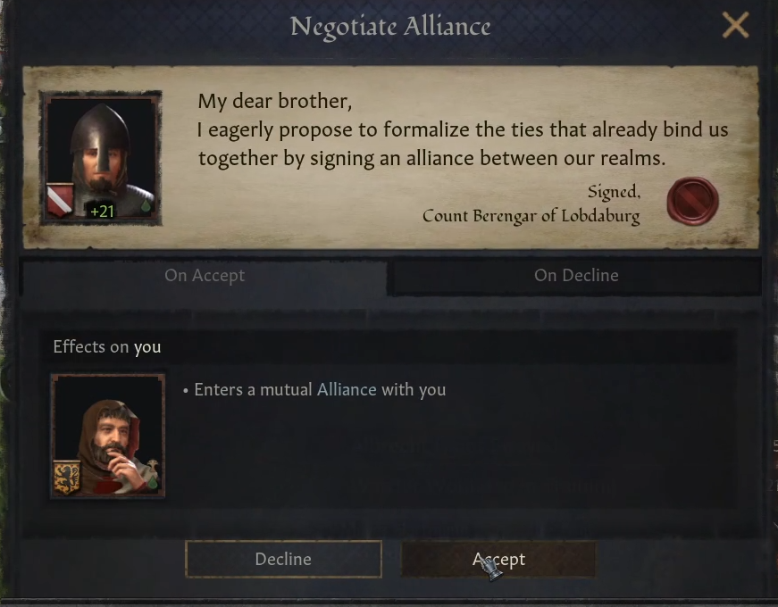

As the Kaiser moves what remaining troops he has south to deal with the Alpine Revolt, peasants in Bohemia take up arms against their liege. The current discontent is largely due to the perceived loyalty of the current Bohemian king Vratislav II toward the Kaiser Heinrich IV. Though Vratislav had taken up arms against the Kaiser only a few years prior, he was content with making peace in exchange for reduced feudal obligations. Bohemian lives were lost, and still Slavs are considered "outsiders" under German rule.

In response, a particularly influential merchant leader has declared himself the king of an independent Bohemia, and promises to liberate all Slavs from the Kaiser's tyrannical rule. With many of his own subjects taking up arms against him, the current King Vratislav II turns to the Kaiser for help.

Realizing his inability to fight a war on two fronts—and prioritizing access through the Alpine passes to the wealthy regions of Northern Italy—Kaiser Heinrich IV quickly negotiates a peace with the Slavic leader. In exchange for the independence of Slavs in and around Bohemia, the Kaiser would retain suzerainty over other Slavs in the Empire. The new King Tomasz of Bohemia agrees. The former King Vratislav II is now a furious Duke under the peasant king.

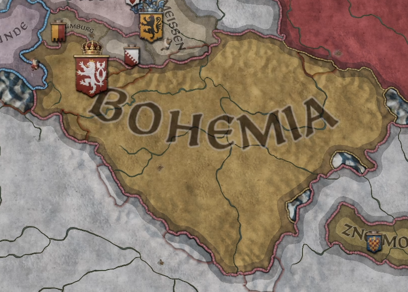

County Lobdaburg has a strong Polabian majority, and is a part of the Kaiser's concessions to King Tomasz. Before Ludwig's brother Count Berengar has a chance to return home from alliance negotiations in Schmalkalden to contest the treaty, King Tomasz installs a loyal Polabian count in the former Ludowinger castle. Ludwig quickly promises war to win back Berengar's rightful position as the Count of Lobdaburg. Independently, the former king Vratislav gathers troops loyal to himself to dethrone the Bohemian pretender.

War is declared.

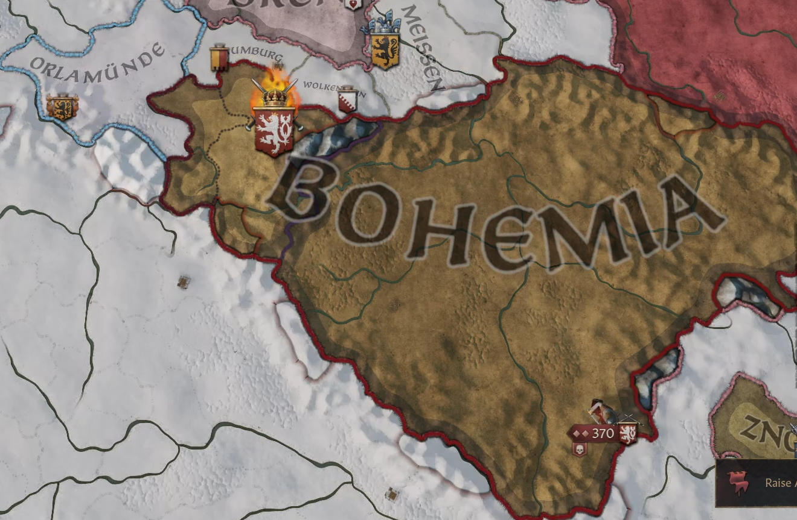

Realizing this will mean goodbye while on campaign, Ludwig spends much "quality time" with his wife while war plans are being drawn up.

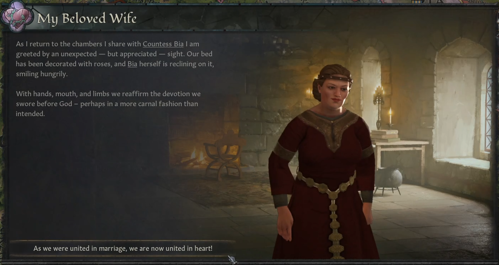

A courier is sent to Ludwig's liege for reinforcements for the war to come.

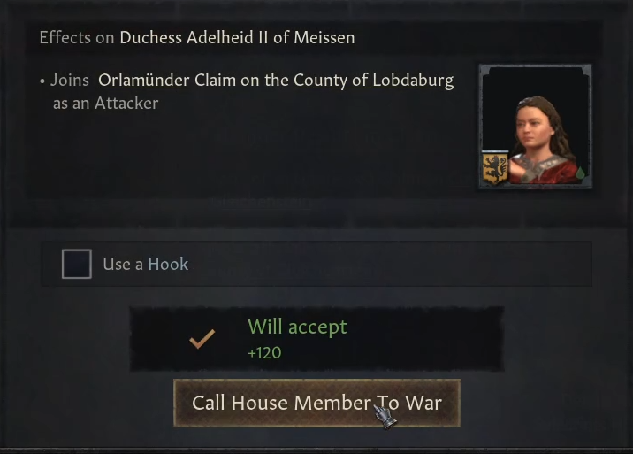

The levies and personal retinue of the Count are quickly gathered, and the now veteran Commander Baldur leads the troops in a siege of Lobdaburg. Soon after, the Margravine leads a siege on the Bohemian capital itself. The troops meet little resistance as the bulk of the forces of King Tomasz are in the east, fighting the former King Vratislav.

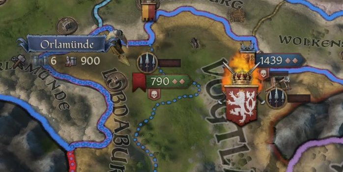

As is routine, Bia gives birth to yet another child as Ludwig is with his troops.

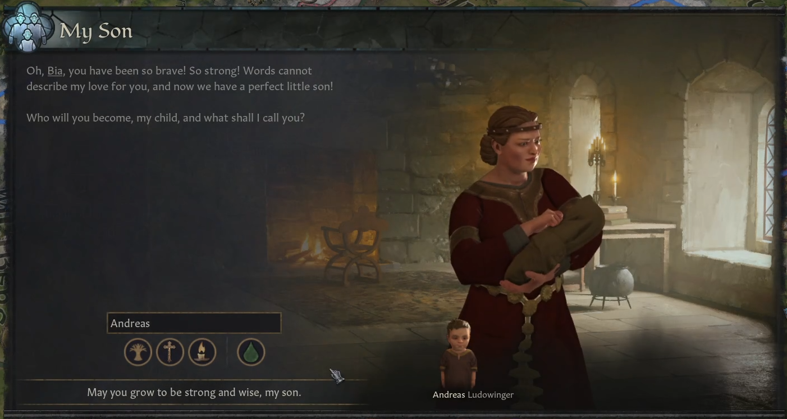

The Lobdaburg falls after a short siege, and the Bohemian capital Reichenbach not long after to the Margravine's troops. Not even leading his troops, King Tomasz is among those captured. A peace is quickly signed, and Lobdaburg returned to the victors.

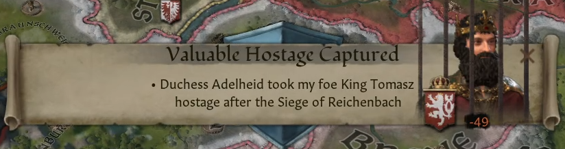

As the war with Bohemia draws to an end, Kaiser Heinrich IV passes under suspicious circumstances. The young Kaiser Heinrich V is voted in by German electors in the subsequent election, both he and his mother the queen regent believed to be easily controlled. However, when the queen regent refuses to acquiesce to subsequent German demands for lower taxes, many vassals immediately revolt against their young new liege.

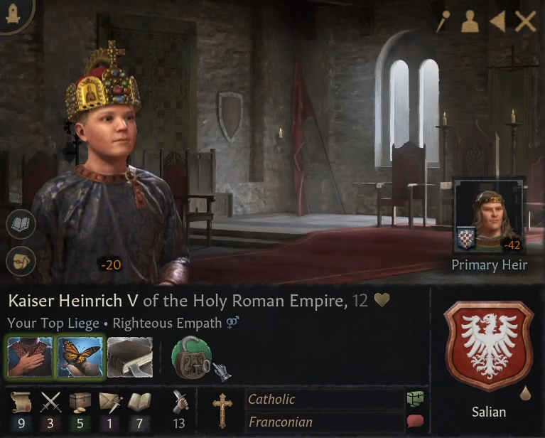

As the Germans fight for lower obligations to their liege, many of the Italian vassals of the Kaiser declare their independence. Her troops already stretched in, the queen regent can do nothing but accept the Italian demands for freedom.

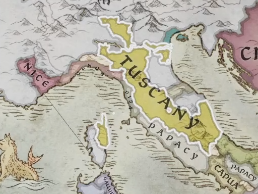

England fares no better than Germany. Though King Magnus was able to defeat Harold Godwineson's war to reclaim the English throne, the powerful Duke Skuli of Northumbria launches his own claim to the throne. Backed by the Scottish King, their combined troops push ever closer to London.

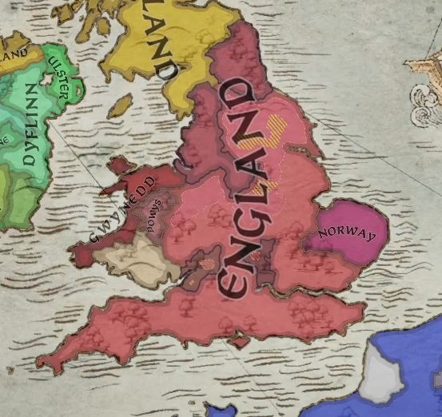

Before Count Ludwig II is able to hand over control of Lobdaburg to his brother, war is declared! Due to its important position controlling a pass through the Thüringian Highland, Duke Berengar II of Nordgau lays claim to Lobdaburg and attacks. Both Count Ludwig and the Margravine turn their already raised levies on the new foe.

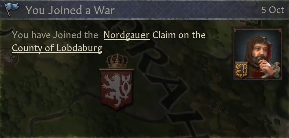

Unfortunately, the Duke of Norgau's troops enter the Thüringian Basin as the Schmalkalden troops head home west and the Meissen troops east. Once again, Commander Baldur finds the enemy between him and allies. Fortunately, the Margravine's troops are just able to escape east, as the Schmalkalden troops take a detour north to rendezvous.

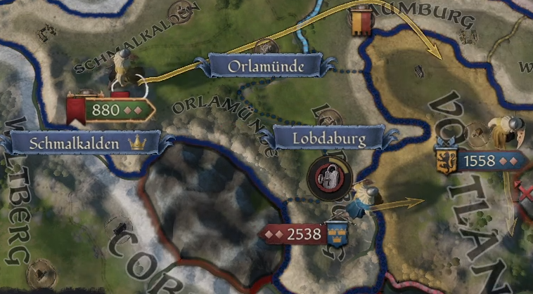

Unfortunately, this buys time for the Duke's allies to also link troops. As the Siege of Lobdaburg finishes—a quick affair, as the garrison did not have time to fully reinforce between wars—the Duke sends his troops down to deal with Ludwig and Adelheid's troops in the south. The only hope for victory for Ludwig and his daughter is a quick siege of the capital and surrounding regions, to force the Duke of Nordgau to the negotiating table.

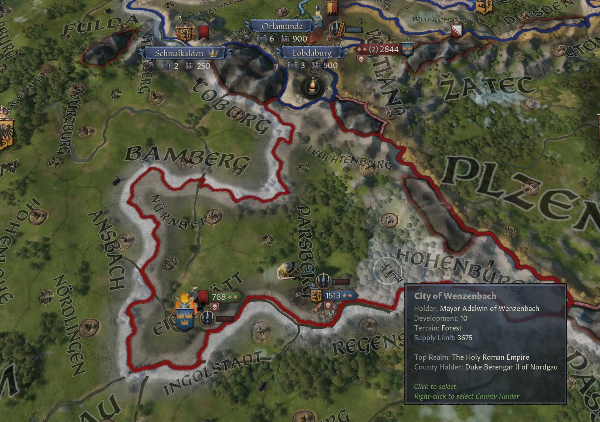

Unfortunately, the Duke's troops catch Ludwig and Adelheid's troops out of position, and is able to defeat Ludwig's troops in detail before Adelheid's troops can arrive. Commander Baldur is forced to make a hasty retreat with what remaining troops he has, and the Duke overwhelms the Meissenian reinforcements that arrive too late.

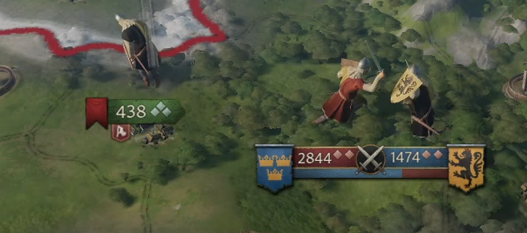

As the remainder of Ludwig's troops reorganize in Schmalkalden, a courier bears news from Brittany. The Count's brother-in-law has passed, leaving his two young nephews counts in Brittany. The current Duke of Brittany believes his new vassals weak, however, and behaves in a tyrannical fashion, taking his political enemies that had taken refuge in the counts' land by force. Remembering his promise to his closest sister—and realizing the war for his brother's land is to soon be lost—he promises to send aid as quickly as he can.

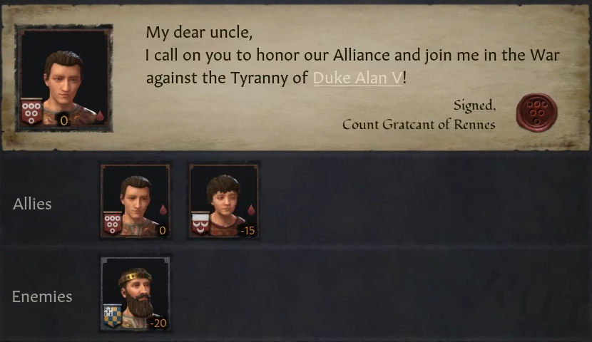

When he ascended to Count of Schmalkalden, Ludwig II released Mayor Hartmann from his unjust imprisonment and torture at the hands of his cruel father. Instead of being grateful for his release, Hartmann continues to curse all Ludowingers for their sadism and depravity. In response, Ludwig tells Hartmann that he is so ugly, "he could scare moss off a rock." Humiliated, Mayor Hartmann backs off.

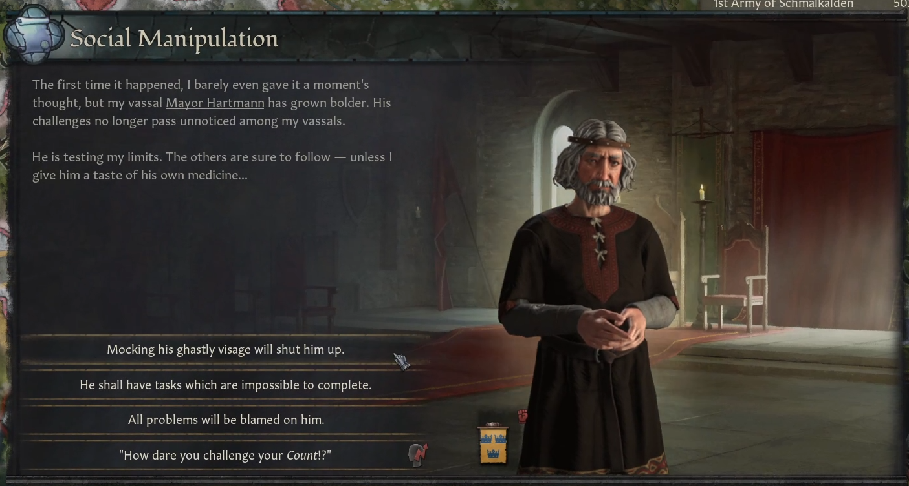

As the remainder of Ludwig's troops march to aid his nephews, they are caught by the Duke of Brittany's army in France. Though Commander Baldur is outnumbered, the quality of his knights over the Briton knights allows him to triumph.

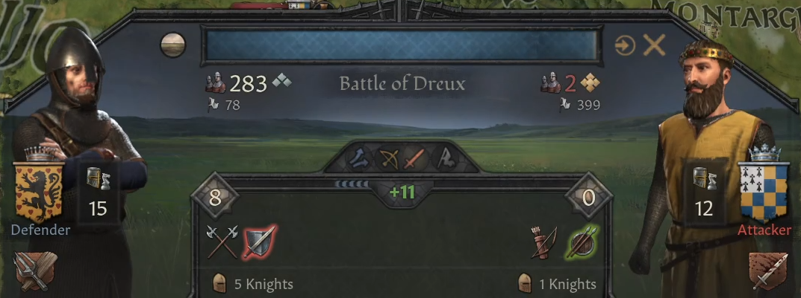

Tidings from Kalisz arrive. Count Ludwig's brother-in-law, Count Jan, has died. Though many Schmalkalden troops fought under Count Ludwig I in wars to help Jan restore his original seat at Poznań, to this day it remains in Silesian hands.

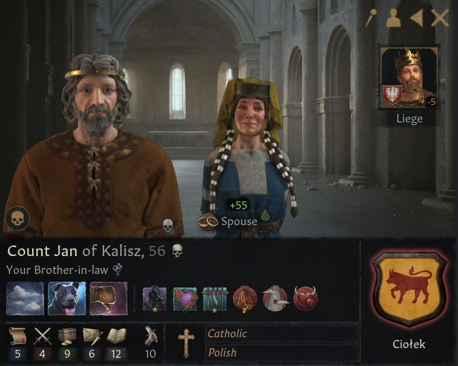

Emboldened by the success of Nice and Tuscany in refusing homage to Kaiser Heinrich V, most other Italian subjects of the Empire fight for their independence. Will they succeed where the failed under Heinrich IV?

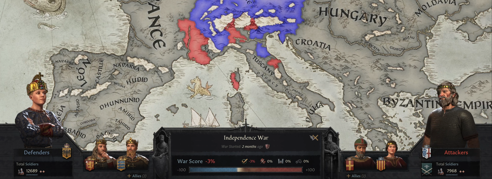

While Count Ludwig's troops return from France, Margravine Adelheid II recognizes the Duke of Nordgau's rule over Lobdaburg. The Second War for Lobdaburg is lost. The Duke immediately puts his son and heir in charge of this strategic mountain pass.

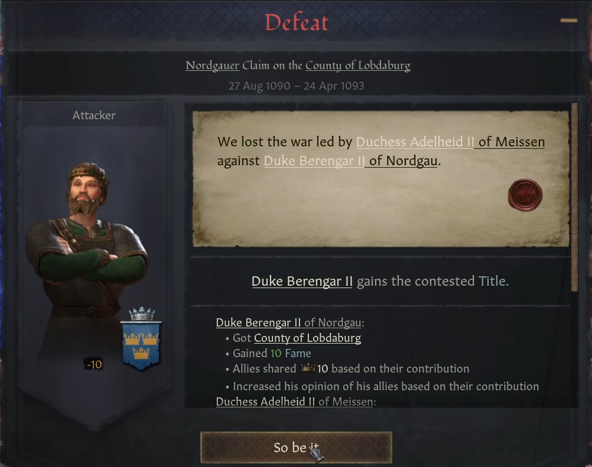

Though only 52, the Count's health declines through the winter and into the spring months.

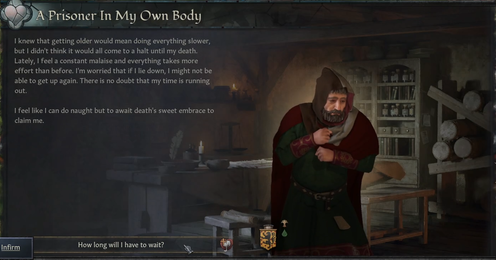

Only half lucid due to illness, the Count begins to have...improper thoughts about his daughter, the Margravine Adelheid II. Perhaps she reminds him of his former wife, the Margravine Adelheid I.

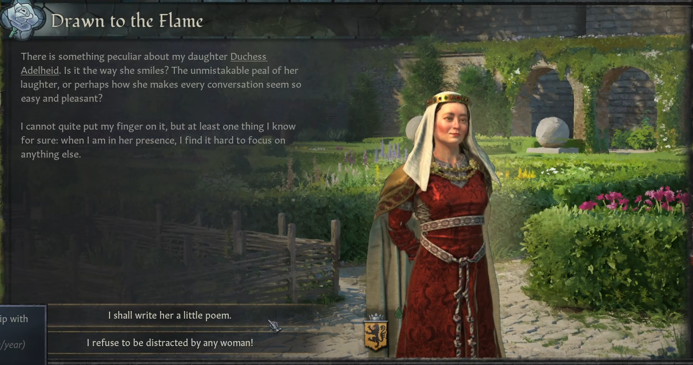

The Count passes not long after. Count Ludwig II was a lover, not a fighter, and was unable to secure Lobdaburg for the dynasty. Fathering many children, it is a small miracle that only one son has survived past childbirth—the rest daughters—and the remaining Ludowinger lands are not split on inheritance. Though fairly incompetent, his heart was bigger than his head, and he will be remembered for his dedication to his family, as his reign was spent constantly engaged in wars on their behalf.

Young Count Ludwig III ascends to Count of Schmalkalden. Though a comfort eater like his mother, Ludwig III is an active child, and his gluttonous habits do not show. A bit of a hot head, the loss of Lobdaburg has set Ludwig III on the path to revenge.

Hopefully he is more successful at wars than his father.

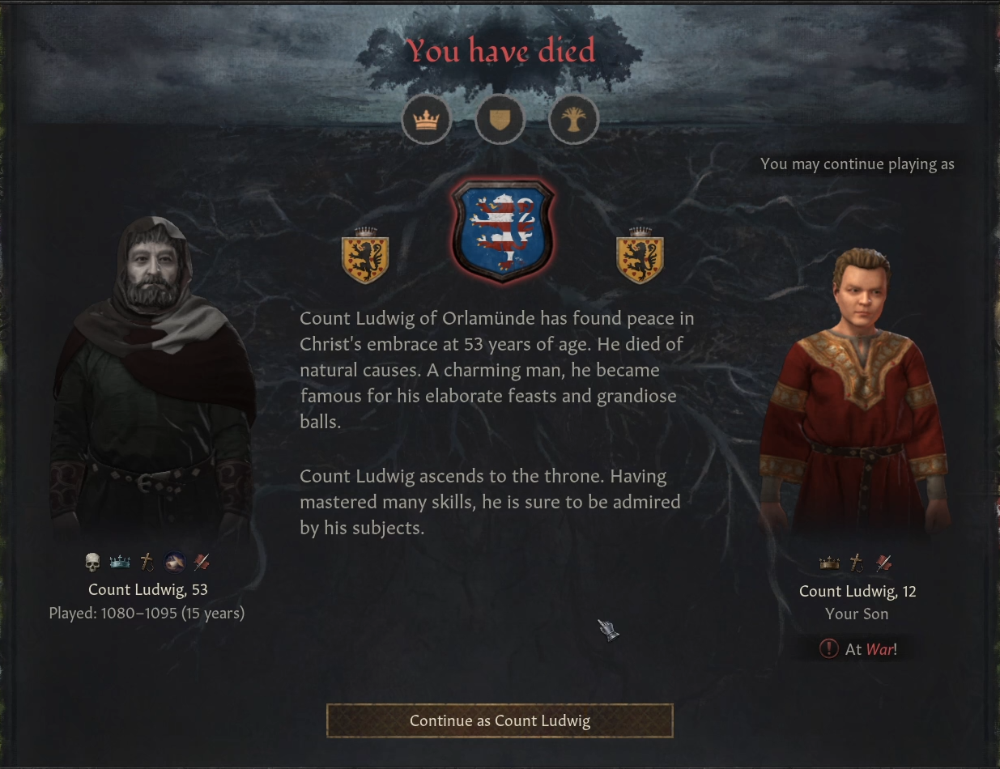

<!--
31:18
-->
